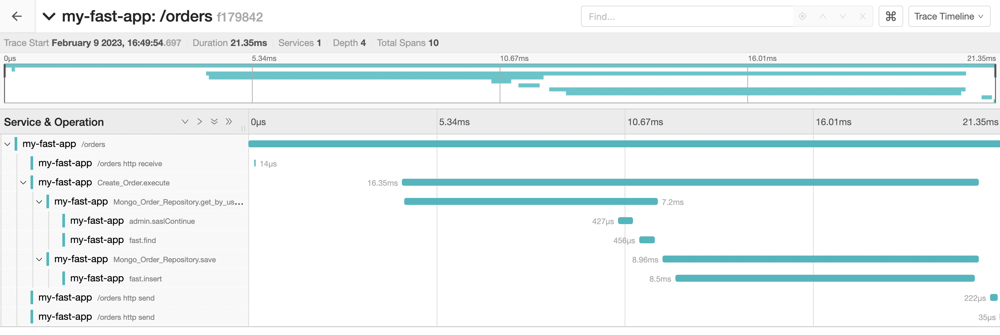

# Python hexagonal architecture

Training python with hexagonal architecture.

- Primary adapter (http): Fast api
- Secondary adapter (database): MongoDB with pymongo

## Run

Run example app with docker and docker-compose.

```bash
docker-compose up
```

## Testing

Run unit tests

```bash
make test-unit
```

Run component tests (with the application running)

```bash
make test-component
```

## Tracing

App instrumented with opentelemetry

- Fast Api auto instrumentation
- Internal logic with custom decorator

View traces in localhost:16686



## Docs

API-docs in localhost/docs

## Database

Mongo express running in localhost:8081


